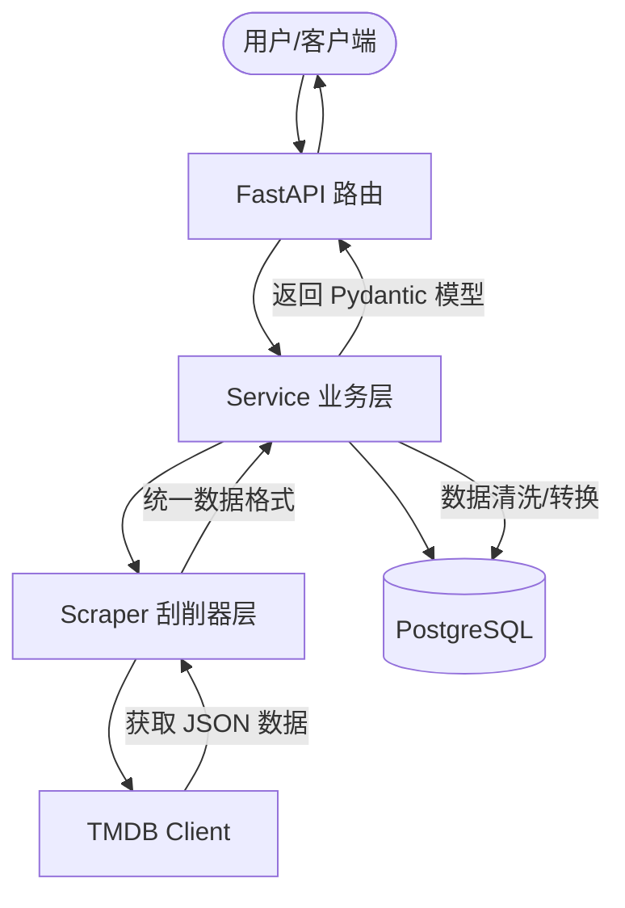

# TMDB 媒体元数据管理后端开发计划

本项目旨在构建一个基于 FastAPI 和 PostgreSQL 的后端服务，用于从 TMDB 获取媒体数据并提供元数据管理功能。

## 1. 技术栈
- **框架**: FastAPI (异步)
- **数据库**: PostgreSQL
- **ORM**: SQLAlchemy (Async) + Alembic (迁移)
- **配置**: TOML
- **API 客户端**: HTTPX (异步)

## 2. 目录结构
```text
e:/codes/tmdbapi/
├── config/
│   ├── default.toml         # 默认配置
│   ├── config.toml          # 本地配置 (Git 忽略)
│   └── config.example.toml  # 配置示例
├── core/
│   ├── __init__.py          # 统一导出入口
│   ├── config.py            # 配置加载逻辑
│   ├── database.py          # 数据库连接与 Session 管理
│   ├── logger.py            # 日志配置
│   └── tmdb_client.py       # 底层 TMDB API 客户端
├── modules/
│   ├── __init__.py
│   ├── media/               # 媒体数据处理逻辑
│   │   ├── models.py        # SQLAlchemy 模型
│   │   ├── schemas.py       # Pydantic 模型
│   │   └── service.py       # 业务逻辑
│   ├── sync/                # 数据同步模块
│   └── scrapers/            # 刮削器模块
│       ├── __init__.py
│       ├── base.py          # 刮削器基类接口
│       ├── tmdb.py          # TMDB 刮削器实现
│       └── mdc.py           # MDC 刮削器实现 (预留)
├── api/                     # FastAPI 路由
│   ├── v1/
│   └── main.py              # FastAPI 入口
├── utils/                   # 通用工具
├── scripts/                 # 辅助脚本
├── ARCHITECTURE.md          # 架构文档
└── .clinerules              # 开发规范
```

## 3. 核心功能计划

### 第一阶段：基础架构搭建
- [ ] 初始化 Python 虚拟环境并安装依赖 (`fastapi`, `uvicorn`, `sqlalchemy`, `asyncpg`, `httpx`, `dynaconf`)。
- [ ] 实现 `core/config.py`，支持从 TOML 加载配置，包括 TMDB API Key 和 `INCLUDE_ADULT` 参数。
- [ ] 实现 `core/database.py`，配置 SQLAlchemy 异步引擎和 Session 工厂。

### 第二阶段：刮削器系统与数据模型
- [ ] 定义统一刮削器接口 (`modules/scrapers/base.py`)，支持 `search` 和 `get_detail` 等标准操作。
- [ ] 开发 `core/tmdb_client.py`：底层 API 通讯封装，处理限流和 `include_adult`。
- [ ] 实现 `modules/scrapers/tmdb.py`：作为 `TMDBScraper` 类，实现基类接口。
- [ ] 预留 `modules/scrapers/mdc.py`：作为 `MDCScraper` 类占位，定义未来接入所需的逻辑接口。
- [ ] 定义数据库模型 (`modules/media/models.py`)：
    - `Movie`, `TVShow` 等模型。
    - 增加 `scraper_source` (来源刮削器) 和 `scraper_id` (来源 ID) 字段。
- [ ] 配置 Alembic 进行数据库迁移管理。

### 第三阶段：业务逻辑与 API 开发
- [ ] 实现数据同步服务：支持按 ID 抓取、按关键词搜索抓取。
- [ ] 开发 FastAPI 路由：
    - `GET /search`: 搜索媒体数据（支持从 TMDB 实时搜索或从本地库搜索）。
    - `GET /movie/{id}`: 获取电影详情。
    - `POST /sync/movie/{id}`: 手动触发同步特定电影。
- [ ] 实现成人内容过滤逻辑：根据配置决定是否在 API 返回中包含成人内容。

### 第四阶段：优化与文档
- [ ] 添加详细的日志记录。
- [ ] 编写 `ARCHITECTURE.md`，描述模块间的调用关系和数据流。
- [ ] 完善 Pydantic 模型，确保 API 输入输出的类型安全。

## 4. 关键逻辑流程 (Mermaid)



## 5. 成人内容处理逻辑 (强制开启)
- **强制注入**: 在 `core/tmdb_client.py` 中，所有请求参数将强制包含 `include_adult=true`。
- **配置覆盖**: 即使配置文件或 API 调用者尝试关闭成人内容，底层客户端也将忽略该指令并保持开启状态。
- **数据保留**: 数据库模型将保留 `adult` 标记字段，但默认查询逻辑将包含所有内容。
